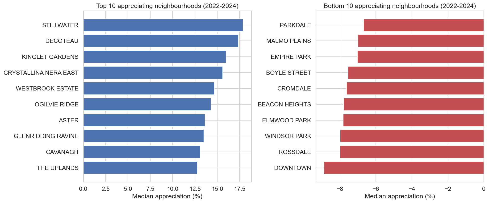

# Edmonton Property Value Drivers

End-to-end statistical analysis of Edmonton residential assessment data, from cleaning and feature engineering to hypothesis testing, regression, and neighbourhood-level appreciation analysis.

Statistical analysis of **1.2 million** property assessment records (2022-2024) from the City of Edmonton Open Data Portal to identify what drives assessed values and which neighbourhoods gained or lost value.

**Methods:** t-test, ANOVA + Tukey HSD, multiple regression (OLS), year-over-year property matching  
**Tools:** Python, pandas, scipy, statsmodels, scikit-learn, matplotlib, seaborn



---

## Key findings

| Finding | Detail |
|---------|--------|
| North-south divide | South Edmonton appreciated **+6%** while north was **flat (-0.5%)** (ANOVA F = 12,809, p < 0.001) |
| Houses vs condos | Single family **+5.3%**, apartments **-4.2%**, a 10-point divergence |
| Garage premium | Raw gap of **$287K** drops to **$116K** after regression controls, revealing confounding by property type |
| Model R-squared | External features explain **15.9%** of value; the rest is mostly interior data the city does not publish |
| Property age | Weak predictor alone (R-squared = **2.9%**); location and property type dominate |
| Citywide appreciation | **+2.52%** median (2022-2024), statistically significant (t = 163, p < 0.001) |
| Top neighbourhood | Stillwater **+18%** |
| Largest decline | Downtown **-9%** |

---

## Motivation

Between 2022 and 2024, Edmonton’s property landscape was shaped by three major forces: rising interest rates, rapid population growth, and heavy suburban development in the south. This project uses the city’s own assessment data to measure how those shifts showed up in residential property values.

---

## What’s inside `analysis.ipynb`

The notebook runs top to bottom and covers:

1. **Data loading and cleaning** across 2022, 2023, and 2024 assessment records
2. **Feature engineering** for zoning groups, garage flags, property age, and neighbourhood-level comparisons
3. **Exploratory analysis** of assessed value distributions citywide and by property type
4. **Neighbourhood analysis** to identify the highest- and lowest-valued areas
5. **Hypothesis testing** for garage effects, zoning differences, and geographic appreciation patterns
6. **Regression modeling** to estimate how age, lot size, zoning, garage, and location relate to assessed value
7. **Appreciation analysis** matching properties across years to measure 2022-2024 neighbourhood change

---

## Method and results

### Data
- **Source:** [City of Edmonton Open Data Portal](https://data.edmonton.ca/City-Administration/Property-Assessment-Data-Historical-/qi6a-xuwt)
- **Records:** 1,065,705 (after cleaning from 1.27M raw)
- **Years:** 2022, 2023, 2024
- **Ingestion:** Custom Python script pulling data via Socrata API with retry logic

### Statistical approach

| Test | Question answered | Key result |
|------|-------------------|------------|
| Independent t-test | Garage vs no garage value difference? | $287K gap, Cohen's d = 1.44 |
| One-way ANOVA + Tukey HSD | Do zoning categories differ? | Single Family $425K > Row $165K > Apartment $118K (all p < 0.001) |
| One-way ANOVA | Do geographic quadrants appreciate differently? | South +6% vs North -0.5% (F = 12,809) |
| Simple linear regression | Does age predict value? | Slope = -$1,759/year, R-squared = 0.029 |
| Multiple regression (OLS) | Combined effect of all features? | R-squared = 0.159; garage drops from $287K to $116K |
| One-sample t-test | Is citywide appreciation real? | +2.52% median, t = 163, p < 0.001 |

See [METHODS_GUIDE.md](METHODS_GUIDE.md) for plain-English explanations of each method.

### What the regression revealed

The raw $287K garage premium shrinks to $116K after controlling for lot size, zoning, age, and location. More than half of the apparent premium is explained by confounding variables: garage properties are mostly detached homes on larger lots.

The model’s R-squared of 15.9% is expected, not a failure. The public data does not include square footage, bedrooms, bathrooms, or condition, which are the strongest drivers of individual property value.

---

## Limitations

- **No interior data.** Square footage, bedrooms, and condition are not in the public dataset, limiting regression explanatory power.
- **Association, not causation.** All findings are statistical associations. Garages do not "cause" higher values.
- **Assessed value is not sale price.** The city’s estimate may differ from actual transaction prices.
- **2024 lot_size quality.** 35.8% null in 2024 (vs 0.7% prior years), making the regression dataset 95% single family homes.

---

## How to run

```bash
git clone https://github.com/HarshP10101/edmonton-property-analysis.git
cd edmonton-property-analysis
python -m venv venv && venv\Scripts\activate   # Windows
pip install -r requirements.txt
python scripts/download_data.py                 # ~200 MB, 2-3 min
jupyter notebook notebooks/analysis.ipynb
```
---
 
## Project structure
 
```
edmonton-property-analysis/
├── data/README.md              # Data dictionary and download instructions
├── notebooks/analysis.ipynb    # Full analysis (8 sections, runs top to bottom)
├── scripts/download_data.py    # Socrata API ingestion with retry logic
├── visuals/                    # Charts exported from the notebook
├── METHODS_GUIDE.md            # Why each statistical method was chosen
├── .gitignore
├── requirements.txt
└── README.md
```
 
---
 
## Sources
 
**2022** | [CBC - Edmonton sales drop after rate hikes](https://www.cbc.ca/news/canada/edmonton/edmonton-real-estate-sales-see-first-large-drop-since-start-of-interest-rate-hikes-1.6585052) | [Global News - Market cooling off](https://globalnews.ca/news/8994346/edmonton-housing-market-cooling-off/) | [Alberta Central - Prairie affordability](https://albertacentral.com/intelligence-centre/economic-news/house-prices-will-have-to-decline-further-to-restore-affordability-except-in-the-prairies/)
 
**2023** | [CBC - 30,000 newcomers to Edmonton](https://www.cbc.ca/news/canada/edmonton/edmonton-international-immigration-conference-board-of-canada-1.7034240) | [CBC - Market predicted to slow](https://www.cbc.ca/amp/1.6718708)
 
**2024** | [RAE - Prices continue to climb](https://realtorsofedmonton.com/statistic/housing-market-activity-prices-continue-to-climb-in-2024/) | [CBC - Housing prices up](https://cbc.ca/amp/1.7261422) | [Global News - Population soared](https://globalnews.ca/news/10517604/calgary-edmonton-population-2023/) | [Statistics Canada - Demographic estimates](https://www150.statcan.gc.ca/n1/daily-quotidien/250116/dq250116b-eng.htm)
 
**Data** | [City of Edmonton Open Data Portal](https://data.edmonton.ca/City-Administration/Property-Assessment-Data-Historical-/qi6a-xuwt)
 
---
 
**Harsh Patel** - Data and Reporting Analyst | [LinkedIn](https://www.linkedin.com/in/harsh-patel-a1563a237/) | [Portfolio](https://harshp10101.github.io/)
